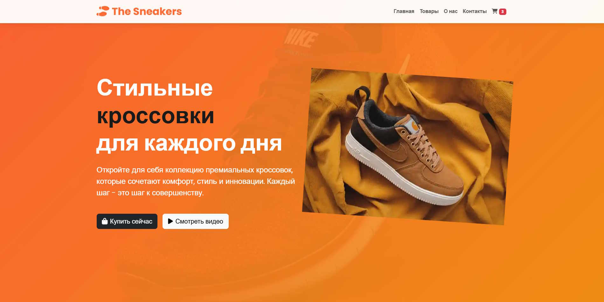
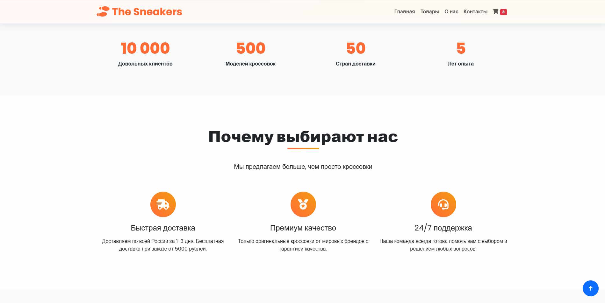
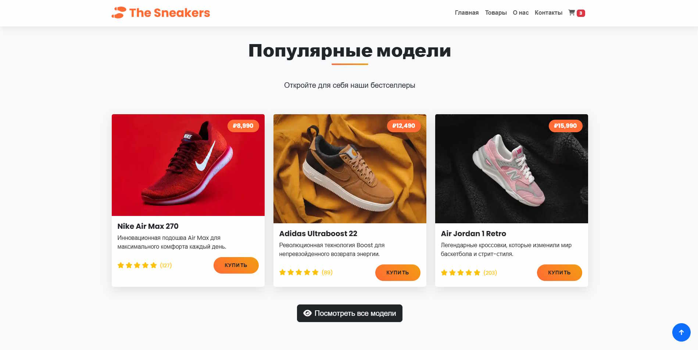
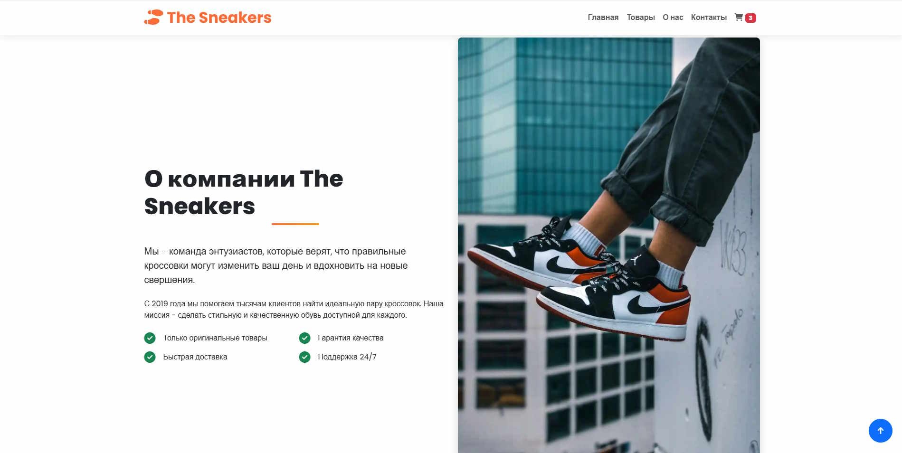
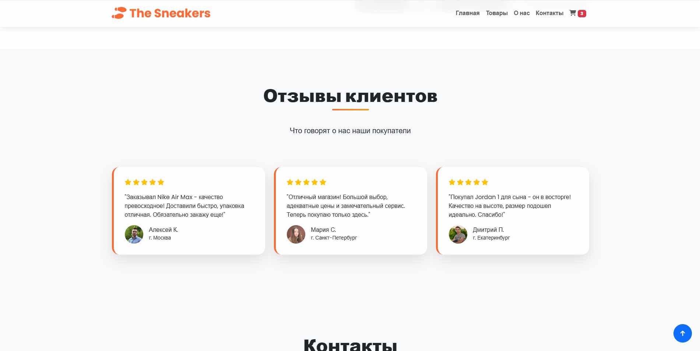
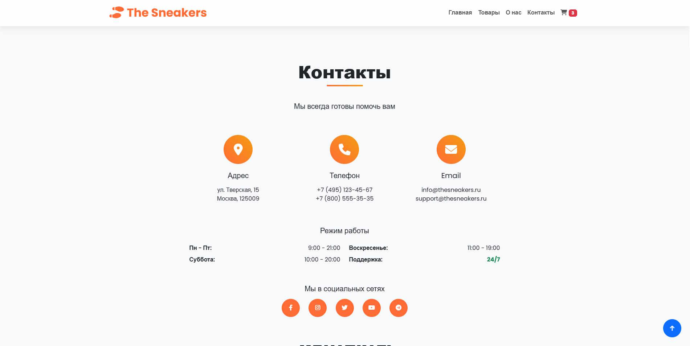
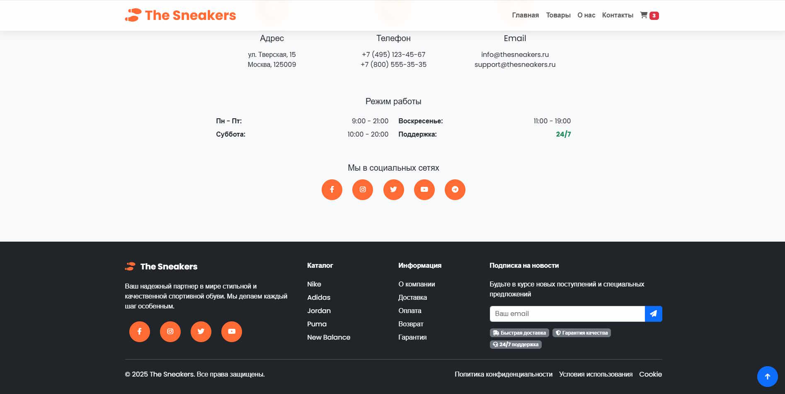

# The Sneakers - Интернет-магазин кроссовок

## Описание проекта
The Sneakers - это современный интернет-магазин стильных кроссовок премиум-класса. Сайт предлагает удобный интерфейс для просмотра каталога, информации о компании и контактных данных. Основные особенности:
- Адаптивный дизайн для всех устройств
- Интерактивные элементы с анимациями
- Секции с популярными товарами, отзывами и статистикой
- Контактная форма и информация о компании

## Технологии

### Основные технологии:
- **HTML5** - семантическая разметка страницы
- **CSS3** - стилизация с использованием кастомных свойств (CSS Variables), анимаций и эффектов hover
- **Bootstrap 5** - адаптивная сетка и компоненты
- **Font Awesome 6** - иконки для UI элементов

### Особенности реализации:

1. **Анимации и эффекты**:
   - Плавные переходы при наведении (hover-эффекты)
   - Анимация "плавающих" кроссовок в геро-секции
   - Анимация появления карточек при скролле
   - Анимация счетчиков статистики с использованием Intersection Observer API

2. **Адаптивность**:
   - Полностью отзывчивый дизайн с медиазапросами
   - Оптимизация для мобильных устройств
   - Гибкая сетка Bootstrap

3. **Оптимизация**:
   - Ленивая загрузка изображений (lazy loading)
   - Оптимизированные CSS-анимации
   - Минимизация перерисовок DOM

4. **Интерактивность**:
   - Плавная прокрутка к секциям
   - Кнопка "Наверх"
   - Интерактивные карточки товаров

## Структура проекта
- Главная страница с hero-секцией
- Секция статистики с анимированными счетчиками
- Секция преимуществ с иконками
- Каталог популярных товаров
- Информация о компании
- Секция отзывов
- Контактная информация
- Футер с навигацией и подпиской

## Установка и запуск
Проект не требует серверной части и может быть запущен непосредственно в браузере:
1. Склонируйте репозиторий
2. Откройте файл `index.html` в браузере

## Особенности дизайна
- Современный минималистичный дизайн
- Градиентные акценты
- Контрастные цветовые сочетания
- Четкая типографика (шрифт Poppins)
- Визуальная иерархия элементов

## Возможные улучшения
- Добавление функционала корзины
- Реализация фильтрации товаров
- Интеграция с платежной системой
- Добавление системы рейтинга товаров
- Реализация блога о новинках кроссовок